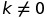
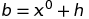

# Лабораторная работа № 6. Безусловный экстремум.

Выполнил студент группы 428  
Гурьянов Максим Олегович

## Вариант № 11
Найти точку **минимума**

методом **сопряженных градиентов**. Для одномерной минимизации использовать метод **квадратичной интерполяции**.
Для поиска интервала унимодальности использовать алгоритм **скользящего окна**.
В окрестности точки минимума построить линии уровня и траекторию поиска (на одном графике). За своевременное
выполнение задания начисляется **6 баллов**.
Реализовав дополнительно следующие методы можно получить по **3 балла** за каждый метод: метод случайного 
поиска, метод Нелдера-Мида, метод Пауэлла, метод Хука-Дживса, метод Розенброка.

## Теоретическая часть

### Метод сопряжённых градиентов
*Алгоритм:* 

Начальный этап. 

Задаём начальное приближение  и задаём точность , с которой будем искать решение. 
Находим формулы компонент градиента функции в произвольной точке: . 
  (счетчик итераций) 

Основной этап. 
1. Вычислим  
2. Проверим выполнение критерия останова  

а) Если критерий выполнен, расчет окончен,  
б) Если критерий не выполнен и  , то переходим к шагу 3. 
в) Если критерий не выполнен и  , то переходим к шагу 4. 

3. Определим  и нормируем этот вектор  
4. Определим  в случае квадратичной ф-ции, а в случае неквадратичной -  
    
5. Определим  и нормируем вектор    
6. Вычислим величину шага  из условия  сведением задачи к поиску минимума
ф-ции одной переменной (одномерный поиск) 
7. Вычислим  
8. Положим  и перейдём к шагу 1. 
### Метод квадратичной интерполяции
*Алгоритм:* 
1. Находим интервал унимодальности  методом скользящего окна 
2. Задаем произвольный шаг  
3. Задаем 3 пробные точки: ,  и, если  , то  , иначе    
4. Вычисляем значения ф-ции в точках :   
5. Находим  (аргумент, при котором получается наименьшее значение функции)  
6. Строим квадратичный интерполяционный многочлен по 3-м точкам и вычисляем его точку минимума по формуле: 
   Если знаменатель в формуле равен нулю, выбираем ,   , и, если  , то  , иначе .  И повторяем нахождение  и    
7. Проверяем выполнение условий останова поиска:  и  
а) Если условия выполняются, то поиск заканчивается,  - минимум ф-ции одной переменной  
б) Если условия не выполняются и , то точка  заменяется на точку,
 и, если  , то  , иначе   
в) Иначе, точка  заменяется на точку,  и, если  , то  , иначе   
8. Вернуться к шагу 4.  
### Эвристический алгоритм скользящего окна нахождения интервала унимодальности близжайшего к заданной точке *x*
*Алгоритм:* 
1. Выбираем исходную точку  и какой-то шаг   
2. Около точки  проверяем условие унимодальности:   
а) Если условие выполняется, то интервал унимодальности найден и ,   
б) Если условие не выполняется, то проверяем условие: .  Если оно выполняется, тогда  заменяется на   (окно сдвигается вправо), иначе  заменяется на (окно сдвигается влево)   
3. Возвращаемся к шагу 2.  
## Практическая часть
Моя работа состоит из 2-х программ:  
1) Программа с реализацией поиска экстремума ф-ции, написанная на языке C++ 
2) Программа для отрисовки линий уровня ф-ции и траектории поиска экстремума, написанная на Python  

Программа на C++ состоит из 1-го файла **`Labb6.cpp`**  

Структура программы: 
* В начале программы продключаются библиотеки:  
     `iostream` - стандартная библиотека ввода/вывода 
     `cmath` - стандартная библиотека для выполнения математических операций  
     `fstream` - библиотека для чтения/записи данных из/в файл  
* `double F(double x1, double x2)` - функция 2-х переменных, которая дана в билете 
* `double grad1(double x1, double x2)` - 1-ая компонента вектора градиента исходной ф-ции 
* `double grad2(double x1, double x2)` - 2-ая компоненту вектора градиента исходной ф-ции 
* В классе `Sopr` описаны переменные и методы, необходмые для отыскания точки экстремума:
  * *private* - методы и переменные класса: 
    * `h` - произвольный шаг, используемый в методе квадратичной интерполяции и методе нахождения интервала унимодальности
    * `k` - счетчик итераций в методе сопряженных градиентов
    * двумерные статические массивы `x0` и  `x1` для записи предыдущего и последующего приближения точки экстремума функции
    * двумерные статические массивы `p0` и  `p1` для записи предыдущего и последующего значений вектора направления                             в методе сопряж-х град-в
    * `fout` - объект класса ofstream для записи в файл новых значений вектора   
    * ` double f(double alfa)` - та же функция `double F(double x1, double x2)`, только для случая, когда переменные x1 и x2 в свою очередь зависят от  . Она необходима для поиска экстремума ф-ции одной переменной в методе квадратичной интерп-ции
    * `double interpMnogochlen(double& x1, double& x2, double& x3)` - квадратичный интерполяционный многочлен, используемый в методе квадр-й интерполяции
    * 'double argmin(double x1, double x2, double x3)' - возвращает один из 3-х аргументов, при котором исходная ф-ция имеет наименьшее значение
    * 'double argmin(double x1, double x2)' - возвращающает один из 2-х аргументов, при котором исходная ф-ция имеет наименьшее значение
    
  * *public* - методы и переменные класса:
    * `int GetIter()` - возвращающает кол-во итераций, за которое удалось найти минимум нашей функции
    * `double* soprGrad()` - реализует *метод сопряженных градиентов*. Возвращает адрес найденной точки минимума.
    * `double KvadrInterp(double a, double b)` - реализует *метод квадратичной интерполяции*. Возвращает минимум ф-ции одной переменной.
    * `void unimodal(double x0, double& a, double& b)` - находит интервал унимодальности нашей ф-ции
   
* В методе `int main()` создается объект типа `Sopr`, у которого вызывается ф-я `soprGrad()`. В консоль выводится найденная точка минимума и кол-во итераций.  
Также ф-я `soprGrad()` создает в папке с программой файл `tr.txt`, в который записываются значения вектора  для построения траектории поиска. 
И в конце с помощью команды `system("linur.py")` вызывается питоновский файл, в котором построенна траектория поиска.  

Программа на Python состоит из 1-го файла **`linur.py`** 

В ней строится картина линий уровня нашей ф-ции с помощью метода `contour()` из библиотеки `pylab` и траектория поиска по данным из файла `tr.txt`. 

**Порядок компилляции/запуска:** 
1. Компиллируем и запускаем файл **`Labb6.cpp`** из командной строки при помощи команды: 
`g++ Labb6.cpp -o Labb6.o`  
2. Запускаем из командной строки `Labb6.o`  

### Результаты
В результате работы программы у функции       был найден экстремум в точке   (начальная точка  ) за ***8*** итераций методами:  
1) Квадратичной интерполяции с точностью    
2) Сопряженных градиентов с точностью    

  